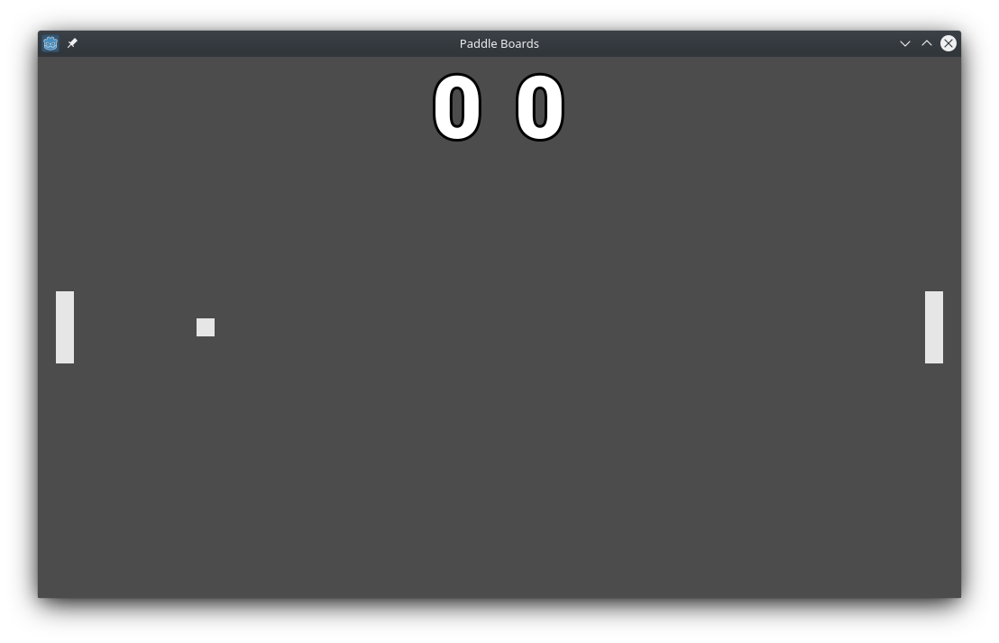

# Paddle Boards
> Open source Pong-like game

This is another one of my projects that I am using to learn about the Godot engine. 
With this I am trying to create some skills with game design and development, 
continuous integration, and unit testing. I would like to apply these skills to
other games that I end up making in the future.



## Installing / Getting started

## Developing

* Clone the repository
```shell
git clone https://github.com/demonpig/paddle-boards.git
```

* Import the ```project.godot``` file with Godot's Project Manager

### Building

The game will simply build using the Godot editor.

## Features

* Local multiplayer

## Contributing

If you'd like to contribute, please fork the repository and use a feature
branch. Pull requests are warmly welcome.

## Links

* Project homepage: https://github.com/demonpig/paddle-boards
* Repository: https://github.com/demonpig/paddle-boards
* Issue tracker: https://github.com/demonpig/paddle-boards/issues

## Licensing

This project is licensed under the GNU General Public License v3.0.
Any art assets that were created specifically for this project will be licensed 
under the Creative Commons CC-BY-SA 4.0 International license. Third party 
assets and/or code will be separated into its own folders and will contain its
license file.
